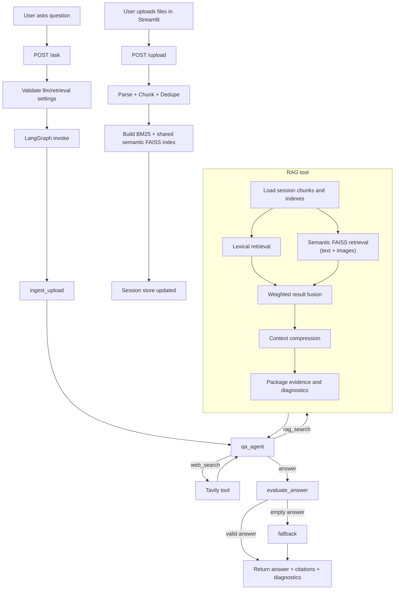

# Multimodal Chatbot

Grounded multimodal question answering app built with FastAPI, Streamlit, LangGraph, and LangChain. Supports OpenRouter and Ollama providers.

## What It Does

- Upload multiple documents (PDF, TXT, Markdown, CSV, DOCX, PPTX, XLSX) and process them immediately.
- Keep uploads session-scoped, with duplicate skipping by normalized file key.
- Sync uploader deselection to backend removal (`/upload/remove`).
- Answer questions with hybrid retrieval (BM25 + semantic vectors) and citations.
- Let `qa_agent` choose between local RAG, Tavily web search, or a direct answer.
- Support follow-up questions using session chat history.
- Expose session-scoped LLM and retrieval controls from backend runtime config.
- Manage stored sessions from the UI: list, switch, delete, and start new session.

## Project Structure Explained

This section explains what each module does and how modules connect.

### 1) Backend (`project/backend/app`)

- `main.py`: FastAPI entrypoint. Creates app state (`settings`, `session_store`, `media_store`, `graph`) and mounts routers.

#### `core/` (shared runtime foundation)

- `config.py`: Central app settings from environment (`.env`) using Pydantic.
- `llm.py`: LLM provider integration and validation for runtime overrides (`model`, `temperature`, `top_p`).
- `runtime_config.py`: Builds safe config payload used by frontend (`GET /config`), excluding secrets.
- `session_store.py`: Thread-safe in-memory session persistence (chat history, uploaded docs, retrieval indices, graph state).

#### `routers/` (HTTP API surface)

- `config.py`: `GET /config` for frontend-safe runtime controls.
- `upload.py`: `POST /upload` and `POST /upload/remove`; parse files, chunk text, build/rebuild indices, update session docs.
- `chat.py`: `POST /ask`; validates settings, invokes LangGraph, returns answer + citations + diagnostics.
- `session.py`: Session lifecycle routes (`GET /sessions`, `GET /sessions/{id}`, `POST /clear-session`).

#### `graph/` (orchestration engine)

- `state.py`: Typed graph state contract shared across all nodes.
- `builder.py`: Declares nodes + edges and compiles workflow.
- `nodes.py`: Independent session ingestion, qa_agent execution, answer evaluation, and fallback handling.
- `edges.py`: Conditional routing helpers between nodes.

#### `services/` (domain logic)

- `parser.py`: Multi-format parser (PDF/TXT/MD/CSV/DOCX/PPTX/XLSX + image support).
- `chunking.py`: Splits parsed pages into chunked passages with overlap.
- `dedupe.py`: Normalized file-key deduplication.
- `lexical_retrieval.py`: BM25 index build + lexical retrieval.
- `semantic_retrieval.py`: Embedding + FAISS vector retrieval.
- `image_assets.py`: Extracts/stores PDF page images and metadata.
- `image_retrieval.py`: Shared multimodal embedding clients used by the semantic FAISS index for text and images.
- `hybrid_retrieval.py`: Weighted reciprocal rank fusion and retrieval diagnostics.
- `qa.py`: Structured qa_agent actions, grounded answer generation, direct-link citation extraction, and web-search orchestration.
- `rag_search.py`: Session-scoped RAG tool combining lexical retrieval with semantic FAISS search over text and image embeddings, fusion, compression, sources, and diagnostics.
- `web_search.py`: Tavily integration for web search augmentation.
- `media_store.py`: Storage abstraction for media artifacts (in-memory/filesystem).

#### `schemas/` (API contracts)

- `request.py`: Request models (`AskRequest`, `RemoveFilesRequest`, etc.).
- `response.py`: Response models (`AskResponse`, upload/session/config responses).

### 2) Frontend (`project/frontend`)

- `app.py`: Streamlit UI entrypoint; uploader sync, chat UI, session controls, answer rendering.
- `api_client.py`: Backend HTTP client wrapper (`/upload`, `/ask`, `/sessions`, `/config`, etc.).
- `utils.py`: Streamlit state helpers and runtime config initialization.
- `components/llm_controls.py`: LLM control widgets.
- `components/retrieval_controls.py`: Retrieval weight / citation control widgets.

### 3) Tests (`project/tests`)

- `conftest.py`: Shared fixtures and test setup.
- `test_api_smoke.py`: API availability and basic route behavior.
- `test_citation_limits.py`: Citation cap behavior.
- `test_clear_session.py`: Session reset behavior.
- `test_duplicate_detection.py`: Upload dedupe logic.
- `test_graph_flow.py`: Orchestration path correctness.
- `test_hybrid_retrieval.py`: Fusion/retrieval logic.
- `test_lexical_retrieval.py`: BM25 retrieval behavior.
- `test_llm_settings_validation.py`: Runtime LLM setting validation.
- `test_parser.py`: Parsing across supported formats.
- `test_runtime_config_endpoint.py`: Runtime config payload behavior.

## End-to-End Workflow



### Workflow in plain terms

1. Upload path: `upload.py` parses files, creates chunks/assets, updates indices, and stores them per session.
2. Ask path: `chat.py` merges runtime overrides and invokes compiled graph from `builder.py`.
3. Ask path: every question reaches `qa_agent` after `ingest_upload` loads session metadata such as uploaded filenames and image counts.
4. Tool path: the agent chooses structured actions: `rag_search`, `web_search`, or `answer`.
5. RAG path: `rag_search(query, session_id)` retrieves the actual uploaded document chunks and images, then performs lexical retrieval plus semantic FAISS retrieval over text and image embeddings, followed by fusion, compression, and source packaging.
6. RAG status path: `no_documents` means the session has no uploaded files; `no_results` means files exist but the query found no matching evidence. Retrieval failures return a structured `error` status.
7. Research path: the agent may perform up to six total tool actions, refine queries, combine evidence, and generate direct Markdown citations.
8. Response path: API returns the answer, citations, agent/tool diagnostics, and effective settings used. Agent planning history is exposed as `agent_decisions`; executed tools are exposed as `tool_trace`.

## Local Setup

1. Install dependencies.

```bash
uv sync
```

On macOS, need to install `faiss-cpu` separately due to `uv` constraints:

```bash
uv pip install faiss-cpu
```

2. Create and edit environment file.

```bash
cp .env.example .env
```

Required values in `.env` depend on selected providers:

- Agent model provider uses `LLM_PROVIDER`.
- Embedding provider uses `EMBEDDING_PROVIDER` (defaults to `LLM_PROVIDER` when omitted).
- OpenRouter usage requires `OPENROUTER_API_KEY`.
- Web search usage requires `TAVILY_API_KEY`.

Examples:

- OpenRouter for both: `LLM_PROVIDER=openrouter` and `EMBEDDING_PROVIDER=openrouter`
- Ollama for both: `LLM_PROVIDER=ollama` and `EMBEDDING_PROVIDER=ollama`
- Mixed mode (requested): `LLM_PROVIDER=ollama` and `EMBEDDING_PROVIDER=openrouter`

For Ollama, keep Ollama server running locally (`ollama serve`) and pull models first (for example `ollama pull gemma4:26b` and `ollama pull nomic-embed-text`).

Optional runtime tuning values are documented in `.env.example`.

Web search toggles:

- `WEB_SEARCH_ENABLED=true|false`
- `WEB_SEARCH_MAX_RESULTS=5`

3. Start backend.

```bash
uv run uvicorn project.backend.app.main:app --reload --port 8000
```

4. Start frontend.

```bash
uv run streamlit run project/frontend/app.py --server.port 8511
```

5. Run tests.

```bash
uv run pytest project/tests -q
```

## Docker Setup

This repo includes container setup for:

- FastAPI backend on `:8000`
- Streamlit frontend on `:8511`

Ollama is intentionally not containerized. The backend container can call Ollama running on your host machine.

1. Create env file if needed.

```bash
cp .env.example .env
```

2. If using Ollama from outside Docker, update `.env`:

```env
LLM_PROVIDER=ollama
EMBEDDING_PROVIDER=ollama
OLLAMA_BASE_URL=http://host.docker.internal:11434
```

`host.docker.internal` is mapped in `docker-compose.yml` for Linux via `host-gateway`.

3. Build and run containers.

```bash
docker compose up --build
```

4. Open apps:

- Frontend: http://localhost:8511
- Backend health: http://localhost:8000/health

5. Stop containers:

```bash
docker compose down
```

## Runtime Config And Controls

- Frontend fetches safe runtime config from `GET /config`.
- Backend is source of truth for provider, models, defaults, and parameter constraints.
- Config payload excludes secrets.
- Supported controls currently include `model`, `temperature`, `top_p`, `lexical_weight`, `semantic_weight`, and `citations_k`.
- Retrieval weights are normalized server-side before fusion.
- Retrieval depth and citation cap are configured via `.env` using a single setting: `CITATIONS_MAX_K`.

## Session And Upload Behavior

- `st.file_uploader(..., accept_multiple_files=True)` is used with on-change sync.
- Newly selected files are uploaded immediately.
- Deselected files are removed from backend indexes/doc state.
- Duplicate uploads in a session are skipped via normalized key.
- Frontend supports starting a new session, listing stored sessions, switching to a prior session, and deleting a specific session.

## API Endpoints

- `GET /health`
- `GET /config`
- `POST /upload` (multipart form: `session_id`, `files`)
- `POST /upload/remove` (json: `session_id`, `file_keys`)
- `POST /ask` (json: `session_id`, `question`, optional `chat_history`, `llm_settings`, `retrieval_settings`, `citations_k`)
- `POST /clear-session` (json: `session_id`)
- `GET /sessions`
- `GET /sessions/{session_id}`

## Manual Verification Checklist

- Upload 2 supported documents and confirm immediate processing.
- Remove one file in uploader and confirm backend document/index removal effects.
- Re-add a previously removed file and confirm it is processed again.
- Re-upload a duplicate normalized key and confirm it is skipped.
- Ask a question with docs and verify citations + retrieval diagnostics.
- Ask a follow-up and verify context continuity via chat history.
- Change LLM/retrieval controls and verify effective settings in `/ask` response.
- Create a new session, switch between sessions, and delete a session from sidebar.
- Clear current session and confirm frontend/backend reset for that session.

## Privacy Notice

Warning: Do not upload documents containing personal, sensitive, or confidential information. This app calls external LLM/embedding services and stores session data in memory for app functionality.
